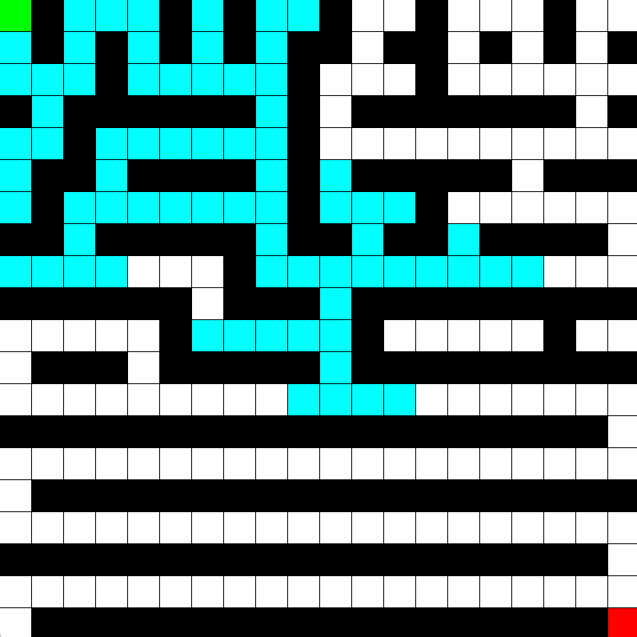
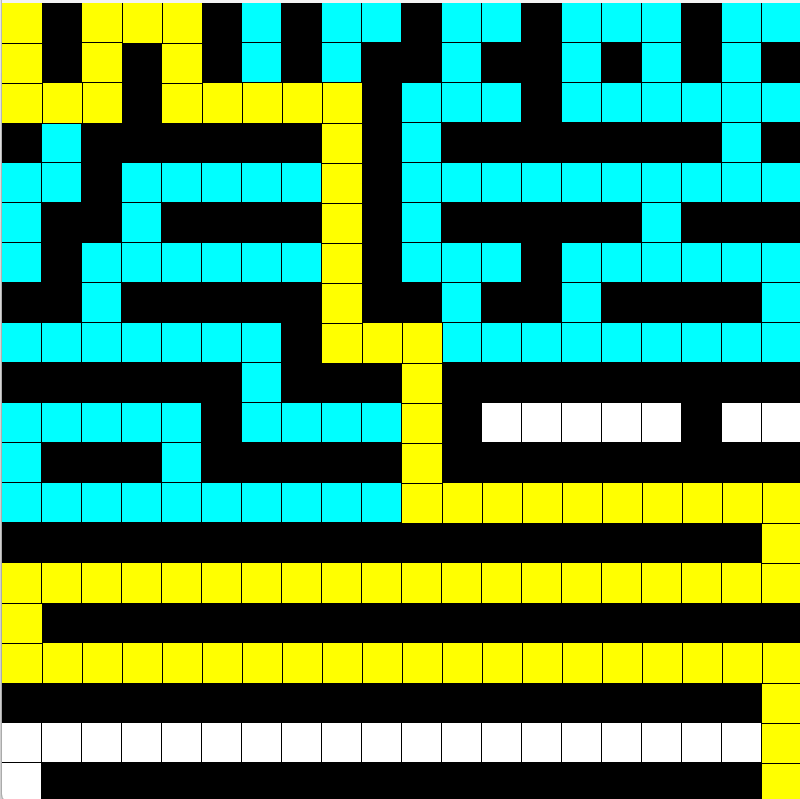

# Maze-Solver-Visualization

This project visualizes four different pathfinding algorithms (Dijkstra, BFS, DFS, and A*) on a grid-based maze. The maze is represented as a 20x20 grid, where each cell can either be a wall or an open path. The user can choose which algorithm to use, and the program will display the steps taken by the chosen algorithm to find the shortest path from the start node to the end node.

### Features

- Visualizes the following pathfinding algorithms:
  - Dijkstra
  - Breadth-First Search (BFS)
  - Depth-First Search (DFS)
  - A*
- Allows the user to load a maze from an input file.
- Displays the process of each algorithm step by step.
- Highlights the final path from the start to the end node.

### Prerequisites

- SFML (Simple and Fast Multimedia Library)

### Usage

1. Create an input file named `input3.txt` in the root directory of the project. The file should contain a 20x20 grid of integers, where `0` represents a wall and `1` represents an open path.

    Example of `input3.txt`:
    ```
    1 1 1 1 1 1 1 1 1 1 1 1 1 1 1 1 1 1 1 1
    1 0 0 0 0 0 0 0 0 0 0 0 0 0 0 0 0 0 0 1
    1 0 1 1 1 1 1 1 1 1 1 1 1 1 1 1 1 1 0 1
    1 0 1 0 0 0 0 0 0 0 0 0 0 0 0 0 0 1 0 1
    1 0 1 0 1 1 1 1 1 1 1 1 1 1 1 1 0 1 0 1
    1 0 1 0 1 0 0 0 0 0 0 0 0 0 1 0 0 1 0 1
    1 0 1 0 1 0 1 1 1 1 1 1 1 0 1 1 0 1 0 1
    1 0 1 0 1 0 1 0 0 0 0 0 1 0 1 1 0 1 0 1
    1 0 1 0 1 0 1 0 1 1 1 0 1 0 0 1 0 1 0 1
    1 0 1 0 1 0 1 0 1 0 1 0 1 1 0 1 0 1 0 1
    1 0 1 0 1 0 1 0 1 0 1 0 1 0 0 1 0 1 0 1
    1 0 1 0 1 0 1 0 1 0 1 0 1 0 1 1 0 1 0 1
    1 0 1 0 1 0 1 0 1 0 1 0 1 1 1 1 0 1 0 1
    1 0 1 0 1 0 1 0 1 0 1 0 1 0 0 1 0 1 0 1
    1 0 1 0 1 0 1 0 1 0 1 0 1 1 0 1 0 1 0 1
    1 0 1 0 1 0 1 0 1 0 1 0 1 0 1 1 0 1 0 1
    1 0 1 0 1 0 1 0 1 0 1 0 1 1 0 1 0 1 0 1
    1 0 1 0 1 0 1 0 1 0 1 0 1 0 1 1 0 1 0 1
    1 0 1 0 1 0 1 0 1 0 1 0 1 0 0 1 0 1 0 1
    1 1 1 1 1 1 1 1 1 1 1 1 1 1 1 1 1 1 1 1
    ```

2. Run the program:
    ```bash
    ./MazeSolver
    ```

3. Choose the algorithm to visualize by entering the corresponding number:
    - `1` for Dijkstra
    - `2` for BFS
    - `3` for DFS
    - `4` for A*

### Screenshots

#### Initial State of the Maze


#### Final State of the Maze with Path Found



If you would like to contribute to this project, please fork the repository and submit a pull request with your changes.

### License

This project is licensed under the MIT License.
